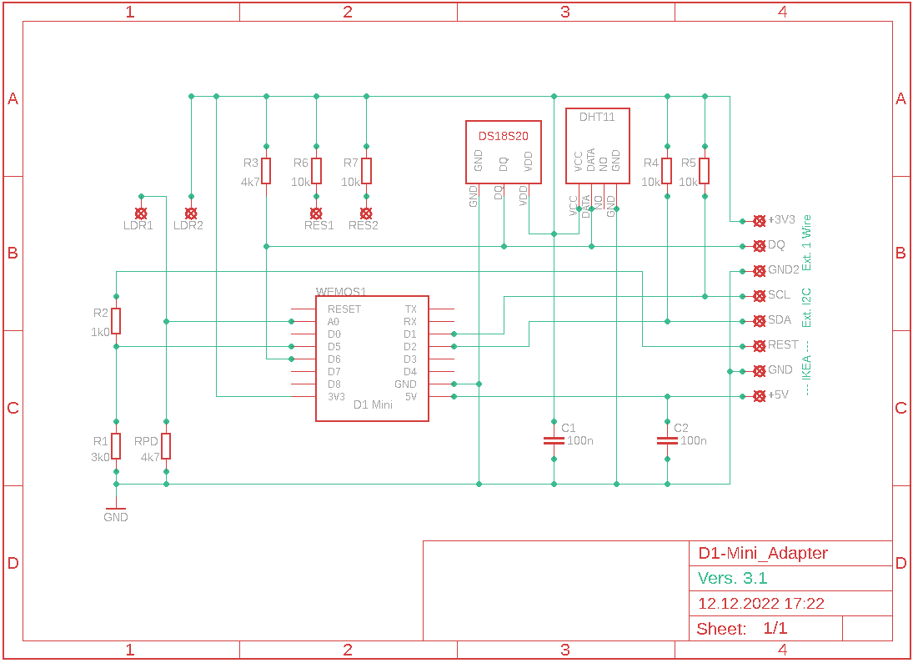
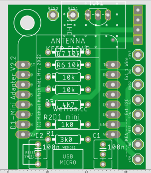

# Michael_Klima

Michaels Raumklima-Monitor. Inspiriert durch den Artikel
"IKEA Vindiktning hacken", siehe Make 5/2021, Seite 14 ff.
Der Code ist vorbereitet für den Anschluß weiterer Sensoren.
Im Original: VINDRIKTNING Ikea Luftguete Sensor -> AdafruitIO

## Life Version

Click Hier: <http://hufschmidt.ddns.krude.de:8080/>

## TODO

An geeigneten MQTT Server anpassen

## Setup März 2022:

Und hier die Adapter-Platine:

## Quellen für den Arduino Code
|Was     |URL                                        |
|--------|------------------------------------------------------------------------|
|General:| <http://hufschmidt.ddns.krude.de:8080/>                                | 
|ESP8266:| <https://github.com/esp8266/Arduino/tree/master/libraries/ESP8266WiFi/>|
|OneWire:| <https://github.com/PaulStoffregen/OneWire/blob/master/OneWire.h>      |
|        |<https://www.arduino.cc/reference/en/libraries/onewire/>                |
|DS18B20:|<https://github.com/milesburton/Arduino-Temperature-Control-Library/blob/master/DallasTemperature.h>|
|DHT11:  |<https://cdn-learn.adafruit.com/downloads/pdf/dht.pdf>|
|        |<https://github.com/adafruit/DHT-sensor-library>|
|MQTT:   |<https://github.com/knolleary/pubsubclient>|

