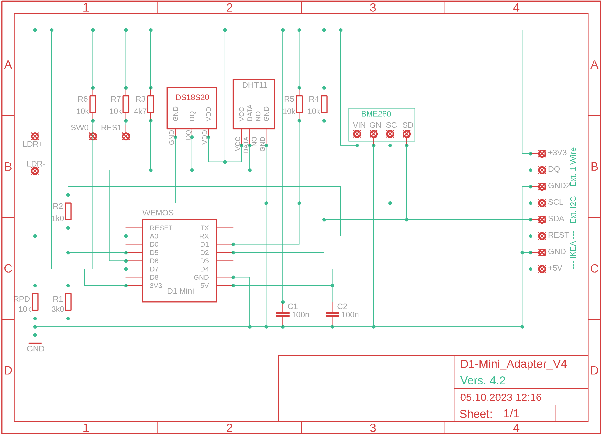

[Zu bearbeiten mit keenwrite.bin oder retext,  File README.md, Version 2025-03-30]: #
# Michael_Klima

Michaels Raumklima-Monitor. Inspiriert durch den Artikel
"IKEA Vindiktning hacken", siehe Make 5/2021, Seite 14 ff und hier: <https://techtest.org/anleitung-wlan-feinstaub-und-temperatur-sensor-ikea-vindriktning-hack/>

Der Code ist vorbereitet für den Anschluß weiterer Sensoren.
Im Original: VINDRIKTNING Ikea Luftgüte Sensor -> AdafruitIO

Mai 2022: Absolute (aber ungenaue) Helligkeitsmessung mit einem LDR Photowiderstand. Parameter müssen in der jeweiligen Zugangsdaten-Datei xxx.h angepasst werden. Siehe LDR-Photometer.pdf.

Sept. 2023: Luftdruck-Sensor BME280 eingebaut, CO2-Sensor SCD-30 vorbereitet.

Okt. 2024: Doku ergänzt.

Nov. 2024: MQTT funktioniert, Doku aktualisiert

Dez. 2024: MQTT jetzt sowohl mit Port 1883 als auch mit Port 8883 (TLS)

Mrz. 2025: Erweitert auf beliebig viele (zur Zeit 10) DS18x20 Sensoren

## Konfiguration und Installation

  1. Den Projekt-Ordner "Michael_Klima" von github.com/MiHuf/ klonen.

  2. Der Mircocontroller "Wemos D1 Mini ESP8266" wird programmiert mit der Arduino IDE <https://www.heise.de/ct/artikel/Arduino-IDE-installieren-und-fit-machen-fuer-ESP8266-und-ESP32-4130814.html>. Die Sprache ist im Wesentlichen C++.  
Vorher müssen noch einige Dateien angepasst werden:

  3. ***Datei "Michael_Klima.h", Zeile 51:***

      #include "privat.h"   
Die Datei "privat.h" enthält persönliche Zugangsdaten. Am besten nimmt man die als Gerüst und kopiert sie in eine neue Datei, z.B. "_mein_privat.h". Alle Dateien mit einem Unterstrich am Anfang des Namens werden von git nicht im öffentlichen Repository gespeichert.  
Anschließend muss die Zeile 56 entsprechend angepasst werden:  
  #include "_mein_privat.h"  

  4. ***Datei "_mein_privat.h":*** 
  
      4.1. In den Zeilen 23 bis 52 sind die aktuell vorhandenden Sensoren definiert, die Zeilen können gelöscht oder umgeordnet werden. 
 
      4.2. In die Sektion "\***** My Settings" kommen dann die privaten Zugangsdaten:  
   #define WIFI_SSID "xxx"  
   #define WIFI_PASS "yyy"  
Das sind die Zugangsdaten zum lokalen WLAN des Routers und ggf. zum Internet.

     4.3. Falls erforderlich, Daten für den MQTT Broker konfigurieren: TOPIC, MQTT_BROKER, MQTT_PORT,  MQTT_USER, MQTT_PASS, ...  
     Achtung: Falls "MQTT_PORT 8883" für TLS gesetzt wird, muss zusätzlich eine Zeile  
   #define MQTT_TLS  
eingefügt werden. Für "MQTT_PORT 1883" muss diese Zeile auskommentert werden.  

      4.4 Der Wemos D1 Mini ESP8266 in dem Modul spannt eigenes WLAN auf, das wird konfiguriert in den Zeilen  
   #define APSSID "zzz"  
   #define OPEN_WIFI  
Das sind die Zugangsdaten zum internen WLAN des ESP8266 (ohne Passwort).

5. ***Anschließend mit der Arduino IDE kompiliern,*** das Modul mit einem Mirco-USB Kabel an den PC anschließen und den Binär-Code auf den D1 Mini hochladen.

    Der ESP8266 konfiguriert sich dann und startet das Programm. Das kann bis zu 2 Minuten dauern, am Ende wird die eingebaute LED fünf mal blinken.

6. ***Für den nächsten Schritt gibt es 2 Möglichkeiten:***

    6.1 Mit einem anderen PC / Touchpad / Handy das WLAN Netzwerk scannen und mit der in Abschnitt 4.2 definierten APSSID (z.B. "zzz") verbinden.

      Dann mit einem Browser (Firefox, Chrome) die Seite `http://192.168.4.1` öffnen. Dann sollte sich eine Seite mit wichtigen Informationen über das Netzwerk öffnen. Merke dir aus der Zeile "External WLAN SSID" den Wert von "IP address" und aus der folgenden Zeile den Wert von "Hostname on Router".

      Falls in der Zeile "External WLAN SSID" keine IP-Adresse angezeigt wird, hat die Verbindung zum WLAN des Routers nicht geklappt. Überprüfe die Zugangsdaten und wiederhole ab Abschnitt 4.2.

    6.2 Gehe auf die Administrations-Seite des Routers, lass dir im Abschnitt "WLAN > Funknetz" die verbundenen Geräte anzeigen. Der ESP8266 sollte unter dem Namen Raumklima-XXX sichtbar sein, wobei XXX die letzten 6 Hex-Ziffern der MAC Addresse ist. Merke dir die zughörige IP-Adresse.

7. ***Geschafft!***
  Ab jetzt sollte der Raumklima Monitor von überall im LAN mit einem Browser sichtbar sein, entweder über die obige IP-Adresse oder über die URL `"http://raumklima-xxx"`.

8. ***Optional:***
  Um einen Zugriff von außen übers Internet einzurichten, muss man im Router einen DDNS-Client installieren und konfigurieren und ferner für raumklima-xxx eine Port-Weiterleitung zur <IP-Adresse des Moduls>:80 erstellen.

## Life Demo

Klicke hier: <http://hufschmidt.ddns.krude.de:8086/> oder <http://hufschmidt.ddns.krude.de:8087/>

## Setup März 2022:

Und hier die Adapter-Platine (35mm x 42mm):

## Quellen für den Arduino Code und für MQTT  Broker
|Was     |URL|
|--------|------------------------------------------------------------------------|
|ESP8266:|<https://github.com/esp8266/Arduino/tree/master/libraries/ESP8266WiFi/>|
|Time-Server:|<https://werner.rothschopf.net/201802_arduino_esp8266_ntp.htm>|
|OneWire:|<https://github.com/PaulStoffregen/OneWire/blob/master/OneWire.h>|
|        |<https://www.arduino.cc/reference/en/libraries/onewire/>|
|DS18B20:|<https://github.com/milesburton/Arduino-Temperature-Control-Library/blob/master/DallasTemperature.h>|
|DHT11:  |<https://cdn-learn.adafruit.com/downloads/pdf/dht.pdf>|
|        |<https://github.com/adafruit/DHT-sensor-library>|
|BME280: |<https://www.az-delivery.de/products/gy-bme280>|
|SCD-30: |<https://www.adafruit.com/product/4867>|
|        |<https://learn.adafruit.com/adafruit-scd30/arduino>|
|MQTT Client Lib|<https://github.com/knolleary/pubsubclient>|
|MQTT Broker Mosquitto:|<http://www.steves-internet-guide.com/install-mosquitto-linux/>|
|InfluxDB:|<https://www.ionos.de/digitalguide/hosting/hosting-technik/was-ist-influxdb/>|
|Grafana: |<https://grafana.com/>|
|MQTT Client Software zum Testen|<http://mqtt-explorer.com/>|
|MQTT Broker, Übersicht|<https://mntolia.com/10-free-public-private-mqtt-brokers-for-testing-prototyping/>|
|MQTT Broker HiveMQ:| <https://www.hivemq.com/>|
|MQTT Broker Cedalo / Pro Mosquitto| <https://test.mosquitto.org/>|
|MQTT Broker flespi|<https://flespi.com/>|
|MQTT Broker sensatio:|<https://www.sensatio.io/>|

---
